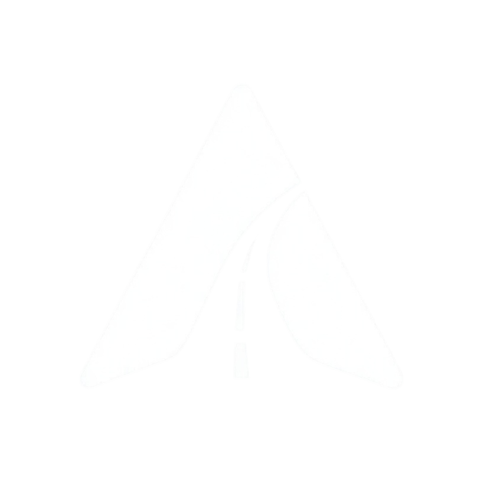

<!-- Improved compatibility of back to top link: See: https://github.com/othneildrew/Best-README-Template/pull/73 -->
<a id="readme-top"></a>
<!--
*** Thanks for checking out the Best-README-Template. If you have a suggestion
*** that would make this better, please fork the repo and create a pull request
*** or simply open an issue with the tag "enhancement".
*** Don't forget to give the project a star!
*** Thanks again! Now go create something AMAZING! :D
-->

<!-- PROJECT LOGO -->
<br />
<div align="center">
  <a href="https://fixmystreet.maximelust.fr">
    
  </a>

  <h3 align="center">FixMyStreet</h3>

  <p align="center">
    Une application de signalement des défauts routiers pour les cyclistes de Bordeaux Métropole, en liaison avec les mairies locales
    <br />
    <a href="https://fixmystreet.maximelust.fr">Voir la démo</a>
  </p>
</div>


<!-- TABLE OF CONTENTS -->
<details>
  <summary>Sommaire</summary>
  <ol>
    <li>
      <a href="#à-propos-du-projet">À propos du projet</a>
      <ul>
        <li><a href="#construit-avec">Construit avec</a></li>
      </ul>
    </li>
    <li>
      <a href="#getting-started">Getting Started</a>
      <ul>
        <li><a href="#prérequis">Prérequis</a></li>
        <li><a href="#installation">Installation</a></li>
      </ul>
    </li>
  </ol>
</details>


<!-- ABOUT THE PROJECT -->
## À propos du projet

[![Product Name Screen Shot][product-screenshot]](https://fixmystreet.maximelust.fr)

Projet en trio d'étudiants à l'ECV Bordeaux en zème année de Mastère Lead Developer Frontend.

Une application de signalement des défauts routiers pour les cyclistes de Bordeaux Métropole, en liaison avec les mairies locales.

<p align="right">(<a href="#readme-top">revenir en haut</a>)</p>


### Construit avec

This section should list any major frameworks/libraries used to bootstrap your project. Leave any add-ons/plugins for the acknowledgements section. Here are a few examples.

* [![Next][Next.js]][Next-url]
* [![React][React.js]][React-url]
* [![Tailwind][Tailwindcss.com]][Tailwindcss-url]
* [![Leaflet][Leafletjs.com]][Leafletjs-url]
* [![Supabase][Supabase.com]][Supabase-url]

<p align="right">(<a href="#readme-top">revenir en haut</a>)</p>


<!-- GETTING STARTED -->
## Getting Started

Voici les instructions pour installer et faire tourner l'application en local.

### Prérequis

Avant d'installer :
* npm
  ```sh
  npm install npm@latest -g
  ```

### Installation

1. Clonez le repo
   ```sh
   git clone git@github.com:DJKFifou/FixMyStreet.git
   ```
2. Installez les packages NPM
   ```sh
   npm i
   ```
3. Installez Next globalement
   ```sh
   npm i -g next@latest
   ```
3. Créez votre fichier `.env` avec les clés API Supabase
   ```sh
   echo "<les-clés-API-à-récupérer>" >> .env
   ```
5. Lancez l'app
   ```sh
   next dev --experimental-https # flag requis pour faire que le navigateur prenne en compte la PWA
   ```

<p align="right">(<a href="#readme-top">revenir en haut</a>)</p>

<!-- MARKDOWN LINKS & IMAGES -->
<!-- https://www.markdownguide.org/basic-syntax/#reference-style-links -->
[product-screenshot]: public/paysage-01.jpg
[Next.js]: https://img.shields.io/badge/next.js-000000?style=for-the-badge&logo=nextdotjs&logoColor=white
[Next-url]: https://nextjs.org/
[React.js]: https://img.shields.io/badge/React-20232A?style=for-the-badge&logo=react&logoColor=61DAFB
[React-url]: https://reactjs.org/
[Tailwindcss.com]: https://img.shields.io/badge/Tailwindcss-000000?style=for-the-badge&logo=tailwindcss&logoColor=61DAFB
[Tailwindcss-url]: https://tailwindcss.com/
[Leafletjs.com]: https://img.shields.io/badge/Leaflet-FFFFFF?style=for-the-badge&logo=leaflet&logoColor=lightgreen
[Leafletjs-url]: https://leafletjs.com/
[Supabase.com]: https://img.shields.io/badge/Supabase-000000?style=for-the-badge&logo=supabase&logoColor=green
[Supabase-url]: https://supabase.com/
